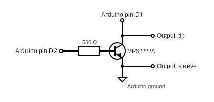

# ESP8266 Sony S-Link Web Controller

A self-contained, web‑based remote control for Sony audio devices that use the **S‑LINK / CTRL‑A(II)** protocol – all running on a single ESP8266.  
Control your amplifier (or other S‑LINK devices) from any browser, send custom hex commands, and see the device’s replies in real time. (the main branch is all of the commands I can implement while the implment will be a trimmed down version with a better UI I actually use.)

## Features

- **Web interface** with pre‑built buttons for common amplifier commands (power, volume, source selection, status queries)
- **Custom command input** – send any hex sequence directly from the web page or serial console
- **Live response display** – replies from the device appear on the page automatically
- **Serial debugging** – all commands and replies printed to the Serial Monitor
- **OTA updates** – ready for ArduinoOTA
- No WebSocket needed – simple HTTP requests + polling

## Hardware

### Required components

- **ESP8266** board (NodeMCU, Wemos D1 Mini, etc.)
- 3.5 mm mono jack or cable to connect to the S‑LINK bus. (Any )
- 2N2222A or really any basic NPN BJT

### Circuit

1. **S‑LINK bus** – two wires: **signal** (tip) and **ground** (sleeve).  
2. Connect the transistor **base** to `GPIO4 (D2)` and the **collector** to `GPIO5 (D1)` on the ESP8266.
   - `GPIO4` → **Output** (sends commands by shorting the two lines) 
   - `GPIO5` → **Input** (reads replies from the sets)
3. Attach the 3.5mm **signal** to the collector (high side) of the transistor so you can read it with D1
4. Attach the 3.5mm **ground** to the emitter (low side) and connect the ESP ground as well to consolidate the grounds.




A small series resistor (e.g., 220 Ω) on the output pin is recommended to limit current when the bus is driven low by another device.

## What is S‑LINK?

S‑LINK (also called **Control‑A1** or **CTRL‑A(II)**) is a two‑wire, open‑collector bus used by Sony to let Hi‑Fi components talk to each other. It’s bidirectional and supports many device types (amplifiers, CD players, MD recorders, tuners, etc.).  
Commands and replies are sent as short pulses – a 2400 µs sync pulse followed by 8‑bit bytes, where a 1200 µs pulse is a `1` and a 600 µs pulse is a `0`.

This project focuses on the **amplifier** (device prefix `C0` / `C8`), but you can easily adapt the buttons or send any code from the full protocol list.

## Software

### Dependencies (Arduino libraries)

- `ESP8266WiFiMulti`
- `ESP8266WebServer`
- `ESP8266mDNS`
- `ArduinoOTA`

All are included with the ESP8266 Arduino core – no extra installation required.

### Configuration

1. Create a file named `secrets.h` in the same folder as the sketch, with your Wi‑Fi credentials:

   ```cpp
   // secrets.h
   #ifndef SECRETS_H
   #define SECRETS_H

   const char* WIFI_SSID   = "Your_Primary_Network";
   const char* WIFI_PASSWORD = "Primary_Password";

   const char* WIFI_SSID2   = "Your_Backup_Network";   // leave empty if not needed
   const char* WIFI_PASSWORD2 = "Backup_Password";

   #endif
   ```

2. (Optional) Change the hostname in the sketch. Default: `"tuner"`.

3. Upload the sketch to your ESP8266.

4. Open the Serial Monitor (115200 baud) to see connection status, debug output, and the assigned IP address.

### Usage

#### Web Interface

Navigate to `http://<esp-ip>` or in a browser. You’ll see:

- **Power**, **Volume**, **Mute/Unmute** buttons
- **Audio** buttons for mute, unmute, 5.1 input on/off (this really just switches to the multi), and 2nd audio status request
- **Source** selection (Tuner, CD, MD, Tape, Video 1/2, DVD)
- **Query Status** buttons
- **Custom Command** text field – type any hex string (e.g., `C0 0F`) and click Send
- **Response** box that updates every second with the latest reply from the device

All commands are sent with the amplifier prefix `C0` (write) – adjust button codes if you want to control another device type.

#### Serial Console

In the Serial Monitor (set line ending to **Newline**), you can type any hex command and press Enter. For example:

```
C0 2E
C0 0F
C0 50 02
```

The ESP will send it immediately and print both the outgoing command and any incoming reply.

### Adapting for other devices

The current web buttons are hardcoded for an amplifier (`C0` prefix). To control a different S‑LINK device, edit the `onclick` values in `handleRoot()`:

- CD player: prefix `90`
- MD recorder: prefix `B0`
- Tuner: prefix `C1` (note: the hostname is `tuner`, but the web buttons control the amplifier; you can change both)
- Surround: prefix `C3`

See the full command list at [boehmel.de/slink.htm](https://boehmel.de/slink.htm).

## Sources & Credits

- Original ESP8266 S‑LINK code (WebSocket version) by [robho](https://github.com/robho/sony_slink) – used as the foundation for bus handling and interrupt logic.
- S‑LINK protocol description and command tables by [Stefan Böhme](https://boehmel.de/slink.htm) – essential reference for device codes and message formats.
- This project replaces the WebSocket interface with a simple web server, adds Wi‑Fi failover, serial debugging, and a custom command input.

## License

This project is open‑source under the MIT License, consistent with the original work by robho.  
See the [LICENSE](LICENSE) file for details.
```
